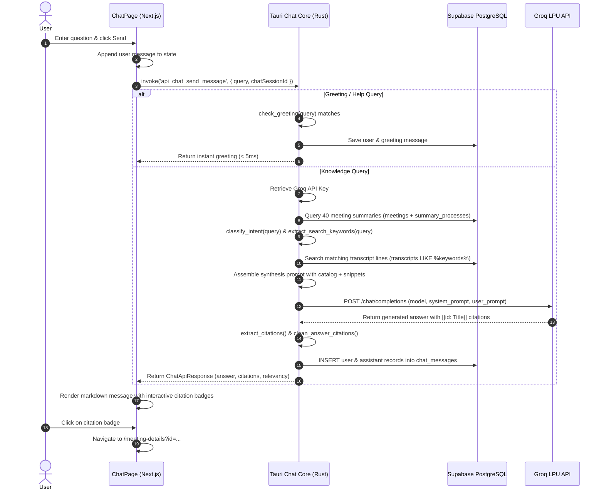

# CrestMeet: Meeting Chatbot Architecture Report

## 1. Executive Summary & Purpose

The **CrestMeet Meeting Chatbot** is an AI-powered conversational assistant that operates across a user's entire library of meetings. Rather than limiting AI interaction to a single transcript at a time, the Chatbot serves as a **cross-meeting knowledge retrieval system (Retrieval-Augmented Generation / RAG)**.

### Primary Capabilities:
- **Cross-Meeting Knowledge Retrieval**: Answers natural language questions synthesized across dozens of separate meeting sessions (e.g., *"What decisions were made about product pricing across all meetings this month?"*).
- **Automated Task & Action Item Aggregation**: Collects pending to-dos, assigned owners, and deliverables scattered throughout past meetings.
- **Clickable Meeting Citations**: Every factual assertion links back to its source meeting ID and title, allowing users to jump directly to the specific meeting details with a single click.
- **Zero-Latency Intent & Greeting Routing**: Instantly recognizes common conversational greetings and intent classifications without unnecessary database queries or external LLM API costs.
- **Privacy & Multi-Tenant Security**: Queries are strictly scoped to the authenticated user's `user_id`, ensuring zero cross-tenant leakage between colleagues or organizations.

---

## 2. High-Level Architectural Topology

```
┌──────────────────────────────────────────────────────────────────────────────────────────────────┐
│                                       FRONTEND (Next.js 14 / React)                              │
│                                                                                                  │
│   ┌──────────────────────────────────────────────────────────────────────────────────────────┐   │
│   │  Chat Page (/chat - ChatPage.tsx)                                                        │   │
│   │  ├── Interactive Suggested Prompts (Pending Action Items, Decisions, Deadlines)          │   │
│   │  ├── Message History Stream (Markdown Rendering with React-Markdown + Remark-GFM)         │   │
│   │  ├── Clickable Meeting Citation Badges (Navigate to /meeting-details?id=...)             │   │
│   │  └── Session Management (localStorage Session UUID, "New Chat", "Clear History")         │   │
│   └─────────────────────────────────────────────┬────────────────────────────────────────────┘   │
└─────────────────────────────────────────────────┼────────────────────────────────────────────────┘
                                                  │ Tauri IPC (invoke)
                                                  │ api_chat_send_message / api_chat_get_history
                                                  ▼
┌──────────────────────────────────────────────────────────────────────────────────────────────────┐
│                                     TAURI / RUST BACKEND CORE                                    │
│                                           (src/chat/mod.rs)                                      │
│                                                                                                  │
│   ┌──────────────────────┐  Step 0  ┌────────────────────────────────────────────────────────┐  │
│   │ check_greeting()     ├─────────►│ Instant response for "hi", "help", "who are you"       │  │
│   └──────────────────────┘          └────────────────────────────────────────────────────────┘  │
│                                                                                                  │
│   ┌──────────────────────┐  Step 1  ┌────────────────────────────────────────────────────────┐  │
│   │ Credential Resolver  ├─────────►│ Read Groq API Key from credentials.json / SettingsRepo │  │
│   └──────────────────────┘          └────────────────────────────────────────────────────────┘  │
│                                                                                                  │
│   ┌──────────────────────┐  Step 2  ┌────────────────────────────────────────────────────────┐  │
│   │ Catalog Aggregator   ├─────────►│ Fetch up to 40 recent meetings & structured summaries  │  │
│   └──────────────────────┘          └────────────────────────────────────────────────────────┘  │
│                                                                                                  │
│   ┌──────────────────────┐  Step 3  ┌────────────────────────────────────────────────────────┐  │
│   │ Query Classifier &   ├─────────►│ • Intent: ActionItems | Decisions | GeneralSearch      │  │
│   │ Lexical Dialogue RAG │          │ • SQL ILIKE search against transcripts table           │  │
│   └──────────────────────┘          └────────────────────────────────────────────────────────┘  │
│                                                                                                  │
│   ┌──────────────────────┐  Step 4  ┌────────────────────────────────────────────────────────┐  │
│   │ Prompt Assembler     ├─────────►│ Inject catalog overviews, action items, & transcripts  │  │
│   └──────────────────────┘          └────────────────────────────────────────────────────────┘  │
│                                                                                                  │
│   ┌──────────────────────┐  Step 5  ┌────────────────────────────────────────────────────────┐  │
│   │ Groq LPU Synthesizer ├─────────►│ POST https://api.groq.com/openai/v1/chat/completions   │  │
│   └──────────────────────┘          └────────────────────────────────────────────────────────┘  │
│                                                                                                  │
│   ┌──────────────────────┐  Step 6  ┌────────────────────────────────────────────────────────┐  │
│   │ Citation Parser &    ├─────────►│ Parse [[id: Title]], calculate relevancy score, format │  │
│   │ Response Cleaner     │          │ clean markdown                                         │  │
│   └──────────────────────┘          └────────────────────────────────────────────────────────┘  │
└───────────────────────────────────┬───────────────────────────────┬──────────────────────────────┘
                                    │ SQLx PgPool                   │ HTTPS / TLS 1.3
                                    ▼                               ▼
┌───────────────────────────────────────────────┐   ┌──────────────────────────────────────────────┐
│            SUPABASE POSTGRESQL                │   │                GROQ CLOUD LPU                │
│                                               │   │                                              │
│  - meetings (User meeting records)            │   │  Ultra-low latency inference engine:         │
│  - transcripts (Verbatim dialog & timestamps) │   │  • Model: openai/gpt-oss-120b                │
│  - summary_processes (Pre-computed summaries) │   │    or llama-3.3-70b-versatile                │
│  - chat_messages (Session conversation logs)  │   │  • Temperature: 0.2                          │
└───────────────────────────────────────────────┘   └──────────────────────────────────────────────┘
```

---

## 3. End-to-End Processing Pipeline

When a user submits a question in the chat interface, the query undergoes a structured 7-stage pipeline inside [`frontend/src-tauri/src/chat/mod.rs`](file:///c:/Projects-Crest/meetily/frontend/src-tauri/src/chat/mod.rs):

### Stage 0: Instant Greeting & Help Detection
- **Function**: `check_greeting(query: &str) -> Option<&'static str>`
- **Logic**: Inspects whether the incoming message is a pure greeting (`"hi"`, `"hello"`, `"good morning"`) or capability inquiry (`"who are you"`, `"help"`, `"what can you do"`).
- **Benefit**: Responds in under **5 milliseconds** directly from memory, eliminating database load and saving Groq API tokens.

### Stage 1: Credential & Engine Validation
- Resolves the active Groq API key:
  1. Checks `SettingsRepository::get_model_config_for_user()` / local credentials store.
  2. Falls back to the `GROQ_API_KEY` environment variable.
- If no key is configured, halts gracefully and returns an actionable error instructing the user to configure their key under **Settings ➔ AI Model**.

### Stage 2: Meeting Catalog Extraction
- **Function**: `fetch_user_meeting_catalog(pool, user_id)`
- Queries the latest **40 meetings** belonging to `user_id` joined with `summary_processes.result`.
- Extracts:
  - Meeting ID, Title, and Date.
  - High-level executive overview.
  - Key decision items.
  - Action items, task descriptions, and assignees.

### Stage 3: Intent Classification & Lexical Dialogue Search
1. **Intent Classification** (`classify_intent`):
   - `QueryIntent::ActionItems`: Triggered by phrases like *"action items"*, *"todos"*, *"pending tasks"*, *"assigned"*.
   - `QueryIntent::Decisions`: Triggered by phrases like *"what did we decide"*, *"decisions"*, *"agreed on"*.
   - `QueryIntent::SummaryOverview`: Triggered by *"summarize all"*, *"meetings this week"*, *"recap"*.
   - `QueryIntent::GeneralSearch`: Catch-all for topic-specific questions.
2. **Keyword Extraction** (`extract_search_keywords`):
   - Strips 30+ domain stop words (`"the"`, `"with"`, `"could"`, `"about"`, etc.) while preserving business nouns, names, and technical terms.
3. **Verbatim Dialogue Retrieval** (`search_transcript_dialogue`):
   - Constructs dynamic SQL wildcards (`LOWER(t.transcript) LIKE ANY($patterns)`).
   - Retrieves the top 15 most relevant raw dialogue lines from the `transcripts` table, complete with speaker timestamps and meeting associations.

### Stage 4: Dynamic Prompt Construction
Builds a two-tier contextual prompt:
1. **Meeting Catalog Section**: Contains structured executive summaries, decisions, and action item lists from recent meetings.
2. **Verbatim Transcript Snippets Section**: Injects raw dialogue quotes matching specific search keywords.
3. **Citation Formatting Instruction**:
   > *"When citing or referencing information from a specific meeting, cite the meeting using this exact syntax: `[[meeting_id: Meeting Title]]`. Keep answers structured, professional, and well-formatted with markdown bullet points."*

### Stage 5: High-Speed LLM Inference via Groq LPU
- **Endpoint**: `https://api.groq.com/openai/v1/chat/completions`
- **Default Models**: `openai/gpt-oss-120b` or `llama-3.3-70b-versatile` (configurable).
- **Sampling Parameters**:
  - `temperature: 0.2` (Low temperature to prevent hallucinations and strictly ground answers in meeting context).
  - `max_tokens: 1500`
  - Timeout: 60 seconds with connection pooling via `reqwest::Client`.

### Stage 6: Citation Parsing & Relevancy Scoring
- **Citation Extraction** (`extract_citations`):
  - Scans response text for `[[meeting_id: Title]]` tokens.
  - Cross-references each ID against the user's meeting catalog to verify authenticity and attach the actual meeting date.
- **Answer Beautification** (`clean_answer_citations`):
  - Converts citation brackets into clean, bold markdown meeting titles (`**Meeting Title**`) for natural readability.
- **Relevancy Scoring**:
  - **High Relevancy (Score 0.85 – 0.95)**: Answer includes 1 or more verified meeting citations.
  - **General Knowledge Match (Score 0.65)**: Answer matched catalog topics without direct citations.
  - **Low Relevancy / Fallback (Score 0.20)**: The AI could not find relevant information in meeting records. Automatically triggers the delivery of the 5 most recent meetings as suggested exploration cards.

### Stage 7: Conversation Persistence
- Stores both the user prompt and the assistant response in the Supabase PostgreSQL `chat_messages` table.
- JSON-serializes the parsed citations for instant historical reload upon returning to the chat page.

---

## 4. Frontend UI & Interaction Design

The chat client is implemented in [`frontend/src/app/chat/page.tsx`](file:///c:/Projects-Crest/meetily/frontend/src/app/chat/page.tsx).

```
┌────────────────────────────────────────────────────────────────────────────────────────┐
│ 💬 Meeting AI Knowledge Assistant                               [🗑️ Clear] [+ New Chat]│
├────────────────────────────────────────────────────────────────────────────────────────┤
│                                                                                        │
│  👤 You: What were the key decisions made in the Sprint Planning meeting?              │
│                                                                                        │
│  🤖 Assistant:                                                                         │
│     According to Sprint Planning 2026, the team agreed to:                             │
│     • Migrate the database connection pooler to Port 6543                              │
│     • Move third-party API keys to local device storage                                │
│                                                                                        │
│     ┌────────────────────────────────────────────────────────┐                         │
│     │ 🏷️ High Relevancy (1 Meeting Cited)                    │                         │
│     │ 📌 Sprint Planning 2026 (2026-09-28) [↗ Open Meeting] │ ◄── Clickable Citation  │
│     └────────────────────────────────────────────────────────┘                         │
│                                                                                        │
├────────────────────────────────────────────────────────────────────────────────────────┤
│ [ 🎯 Pending Action Items ] [ 📋 Key Decisions ] [ ⏱️ Project Deadlines ]             │
│ ┌──────────────────────────────────────────────────────────────────────────┬─────────┐ │
│ │ Ask anything across your meetings...                                     │ 🚀 Send │ │
│ └──────────────────────────────────────────────────────────────────────────┴─────────┘ │
└────────────────────────────────────────────────────────────────────────────────────────┘
```

### Key UI Capabilities:
1. **Interactive Suggested Prompts**:
   - Pre-engineered quick-launch prompts (Pending Action Items, Recent Key Decisions, Project Deadlines, Cross-Meeting Overview) allow users to get insights with one click.
2. **Clickable Citations (`navigateToMeeting`)**:
   - Every citation card rendered below an assistant message is interactive. Clicking it sets the active meeting in context and routes immediately to `/meeting-details?id=<id>`.
3. **Markdown & Syntax Highlighting**:
   - Renders formatted lists, bold terms, blockquotes, and code blocks using `react-markdown` and `remark-gfm`.
4. **Session Isolation**:
   - Manages independent conversation threads via `crestmeet_chat_session_id` in `localStorage`.
   - Starting a **"New Chat"** resets the local session UUID, allowing users to start a fresh topic without losing past conversations.

---

## 5. Cloud Database Schema

The Chatbot is backed by the `chat_messages` table in Supabase PostgreSQL:

```sql
CREATE TABLE public.chat_messages (
    id VARCHAR PRIMARY KEY,
    user_id UUID REFERENCES auth.users(id) ON DELETE CASCADE,
    chat_session_id VARCHAR NOT NULL,
    role VARCHAR NOT NULL,             -- 'user' | 'assistant'
    content TEXT NOT NULL,
    citations JSONB,                   -- Array of MeetingCitation objects
    created_at TIMESTAMPTZ NOT NULL DEFAULT NOW()
);

-- Performance Indexes
CREATE INDEX idx_chat_messages_session ON public.chat_messages(chat_session_id, created_at ASC);
CREATE INDEX idx_chat_messages_user ON public.chat_messages(user_id);
```

### IPC Interface (Tauri Commands)

| Command | Arguments | Returns | Description |
|:---|:---|:---|:---|
| `api_chat_send_message` | `query: String`, `chat_session_id: String` | `ChatApiResponse` | Executes RAG pipeline and generates AI response. |
| `api_chat_get_history` | `chat_session_id: String` | `Vec<ChatMessageRecord>` | Loads past messages for the current conversation thread. |
| `api_chat_clear_history` | `chat_session_id: String` | `bool` | Deletes all messages associated with the active session. |

---

## 6. End-to-End Sequence Diagram



---

## 7. Security, Privacy & Reliability Guardrails

1. **Strict User Scoping**: All queries against `meetings`, `transcripts`, and `chat_messages` include `WHERE user_id = $1`. Users can never query or receive answers derived from another user's meetings.
2. **Hallucination Prevention**: System prompts explicitly command the model to rely solely on the provided meeting catalog and transcript snippets. If a topic was never discussed, the model is instructed to state that the information was not found.
3. **Graceful Fallbacks**: When a search yields no relevant meeting citations, the system sets `is_fallback: true` and presents the user's 5 most recent meetings as quick links so the user is never left with a dead-end response.
4. **Key Security**: Chat queries utilize the user's locally stored Groq API key directly via TLS; keys are never sent to or logged by the Supabase database.
