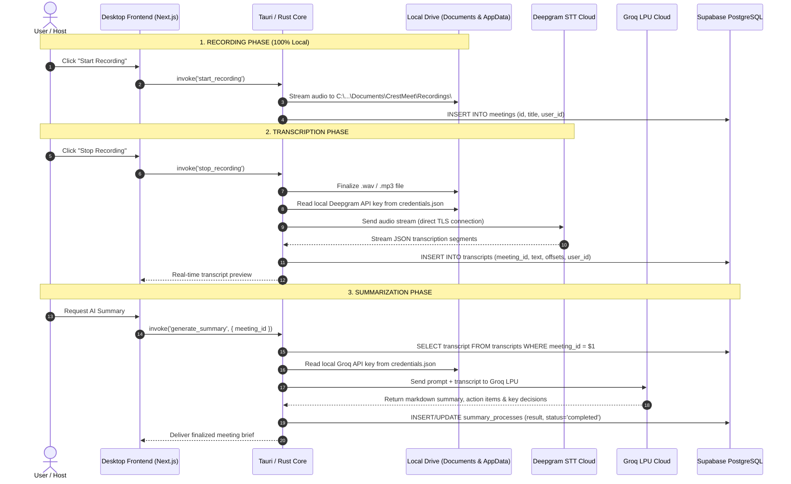

# CrestMeet: Storage & Database Architecture Report

## 1. Executive Summary & Design Principles

CrestMeet employs a **Privacy-First, Hybrid-Storage Architecture** designed to balance high-fidelity media capture, rapid cloud AI capabilities, and data sovereignty.

### Core Architectural Principles:
1. **Local Media Containment**: Heavy multimedia (raw multi-channel audio tracks and full-resolution screen recordings) never leave the user's local machine. This guarantees zero audio leakage, adheres to strict client confidentiality standards, and avoids cloud bandwidth costs.
2. **Decoupled, Zero-Knowledge Credential Isolation**: Third-party LLM and STT API keys (Deepgram, Groq, OpenAI, Anthropic) are saved exclusively to the local operating system's application data store. They are **never stored in the shared cloud database**, eliminating cross-tenant leakage risks when distributing application builds across colleagues or teams.
3. **Multi-Tenant Relational Synchronization**: Collaborative, lightweight, and structured text data—such as meeting records, time-indexed transcripts, AI-generated summaries, and task lists—are synced to a centralized **PostgreSQL database managed by Supabase**, secured with multi-tenant user isolation.

---

## 2. High-Level Architectural Diagram

```
┌──────────────────────────────────────────────────────────────────────────────────────────────────┐
│                                       LOCAL CLIENT WORKSTATION                                   │
│                                                                                                  │
│   ┌───────────────────────────────┐                  ┌────────────────────────────────────────┐  │
│   │     Local Media Storage       │                  │       Secure Local Credentials         │  │
│   │   (Documents/CrestMeet/...)   │                  │     (%APPDATA%/meetily/credentials)    │  │
│   │  ├── meeting_audio.wav/.mp3   │                  │  ├── deepgram_api_key                  │  │
│   │  └── screen_recording.webm    │                  │  └── groq_api_key                      │  │
│   └───────────────▲───────────────┘                  └───────────────────▲────────────────────┘  │
│                   │ Native I/O                                           │ File System IPC        │
│   ┌───────────────┴──────────────────────────────────────────────────────┴────────────────────┐  │
│   │                                   Tauri Core (Rust Engine)                                │  │
│   │  - CPAL Dual-Stream Audio Capture (Mic + System Loopback)                                 │  │
│   │  - WebRTC MediaRecorder Sink                                                              │  │
│   │  - Local Credentials Repository (local_credentials.rs)                                    │  │
│   │  - SQLx Connection Pool (database/repositories/*)                                         │  │
│   └───────────────────────────────────────────────┬───────────────────────────────────────────┘  │
└───────────────────────────────────────────────────┼──────────────────────────────────────────────┘
                                                    │ TLS 1.3 / SQLx PgPool
                                                    ▼
┌──────────────────────────────────────────────────────────────────────────────────────────────────┐
│                                   CLOUD SUPABASE POSTGRESQL                                      │
│                                                                                                  │
│   ┌───────────────────────┐  1:N  ┌────────────────────────┐  1:1  ┌─────────────────────────┐  │
│   │       meetings        ├──────►│      transcripts       ├──────►│    summary_processes    │  │
│   │ (id, title, user_id)  │       │ (text, offsets, user_id│       │ (markdown, action items)│  │
│   └───────────────────────┘       └────────────────────────┘       └─────────────────────────┘  │
│                                                                                                  │
│   ┌───────────────────────┐                                        ┌─────────────────────────┐  │
│   │   transcript_chunks   │ (Real-time transcription chunks)       │        settings         │  │
│   └───────────────────────┘                                        │ (Model choices, UI)     │  │
│                                                                    └─────────────────────────┘  │
└──────────────────────────────────────────────────────────────────────────────────────────────────┘
```

---

## 3. Storage Distribution & Security Matrix

| Component | Storage Location | File / Table Name | Sensitive Content | Cloud Synced? |
|:---|:---|:---|:---:|:---:|
| **Microphone Audio** | Local Filesystem | `*.wav` / `*.mp3` | Raw voice data | ❌ **No** |
| **System Loopback Audio** | Local Filesystem | `*.wav` / `*.mp3` | Remote participants' voice | ❌ **No** |
| **Screen Capture Video** | Local Filesystem | `*.webm` | Screen display | ❌ **No** |
| **Deepgram API Key** | Local AppData Store | `credentials.json` | STT authentication | ❌ **No** |
| **Groq API Key** | Local AppData Store | `credentials.json` | LLM authentication | ❌ **No** |
| **Hardware Device IDs** | Local App Store | `Tauri Store` | Audio interface GUIDs | ❌ **No** |
| **Onboarding State** | Local App Store | `onboarding-status.json` | Setup wizard state | ❌ **No** |
| **Telemetry Consent** | Local App Store | `analytics.json` | Analytics opt-in flag | ❌ **No** |
| **Meeting Records** | Cloud Supabase | `meetings` | Title, dates, owner UUID | ✅ **Yes** |
| **Speech Transcripts** | Cloud Supabase | `transcripts` | Text transcript, offsets | ✅ **Yes** |
| **AI Summaries** | Cloud Supabase | `summary_processes` | Markdown summary, action items | ✅ **Yes** |
| **Preferred Model Names** | Cloud Supabase | `settings` | e.g. `llama-3.3-70b-versatile` | ✅ **Yes** |

---

## 4. Local Storage Deep-Dive (On-Device)

### 4.1. Audio & Screen Recording Filesystem
- **Standard Storage Path**:
  - **Windows**: `C:\Users\<Username>\Documents\CrestMeet\Recordings\`
  - **macOS / Linux**: `~/Documents/CrestMeet/Recordings/`
- **User Customization**: Users can modify the storage directory via `Settings > Recording Preferences`. The path is preserved locally across app updates.
- **File Management & Formats**:
  - `audio.wav` / `audio.mp3`: Captured natively through CPAL (Cross-Platform Audio Library) using dual WASAPI streams (WASAPI input for microphone, WASAPI loopback for system sounds). Encoded in 16-bit PCM or MP3 with stereo interleaving (Left: System Audio, Right: Mic Audio).
  - `screen.webm`: Recorded via WebRTC `MediaRecorder` in 1-second timeslices, using VP9/VP8 video codecs.
- **Retention**: Media files remain on the local disk indefinitely until manually removed or deleted via the application UI.

### 4.2. Local Credentials Isolation (`credentials.json`)
- **Location**: `{app_local_data_dir}/credentials.json`
  - Windows: `%APPDATA%\meetily\credentials.json`
  - macOS: `~/Library/Application Support/meetily/credentials.json`
  - Linux: `~/.config/meetily/credentials.json`
- **Rust Implementation**: Handled by [`frontend/src-tauri/src/local_credentials.rs`](file:///c:/Projects-Crest/meetily/frontend/src-tauri/src/local_credentials.rs).
- **Format**:
  ```json
  {
    "deepgram_api_key": "Token 12345abcdef...",
    "groq_api_key": "gsk_...",
    "openai_api_key": null,
    "anthropic_api_key": null
  }
  ```
- **Why This Matters**:
  When distributing new application builds or installers across teams, colleague machines initialize with their own empty `credentials.json`. No colleague ever inherits or consumes another team member's personal API quota.

### 4.3. Local Device Preferences (`tauri-plugin-store`)
- **`onboarding-status.json`**: Tracks whether the user completed the initial microphone and speaker setup.
- **`analytics.json`**: Stores the consent toggle for anonymous PostHog telemetry (disabled by default).
- **Physical Device GUIDs**: Selected microphone and speaker hardware IDs are stored locally because hardware device identifiers are machine-specific and invalid across different PCs.

---

## 5. Cloud Database Architecture (Supabase / PostgreSQL)

### 5.1. Connection Management & Pooling
- **Driver**: Rust `sqlx` crate with PostgreSQL backend.
- **Connection Configuration**:
  - Uses asynchronous connection pooling via `sqlx::PgPool`.
  - Tuned with connection timeouts and idle reap intervals to prevent connection exhaustion.
  - Compatible with Supabase Transaction Pooler (PgBouncer, Port 6543) and direct connection (Port 5432).

### 5.2. Relational Schema & Tables

#### 1. `meetings` Table
Contains master metadata for every meeting session.
```sql
CREATE TABLE public.meetings (
    id VARCHAR PRIMARY KEY,
    title TEXT NOT NULL,
    created_at TIMESTAMPTZ NOT NULL DEFAULT NOW(),
    updated_at TIMESTAMPTZ NOT NULL DEFAULT NOW(),
    folder_path TEXT,
    user_id UUID REFERENCES auth.users(id) ON DELETE CASCADE
);

CREATE INDEX idx_meetings_user_created ON public.meetings (user_id, created_at DESC);
```
- `folder_path`: Contains the local filesystem reference on the recording machine to assist in opening the local folder from the UI.
- `user_id`: Enforces row-level isolation so that queries (`SELECT * FROM meetings WHERE user_id = $1`) only return the active user's meetings.

#### 2. `transcripts` Table
Holds full speech-to-text outputs and individual conversational segments.
```sql
CREATE TABLE public.transcripts (
    id VARCHAR PRIMARY KEY,
    meeting_id VARCHAR NOT NULL REFERENCES public.meetings(id) ON DELETE CASCADE,
    transcript TEXT NOT NULL,
    timestamp VARCHAR NOT NULL,
    audio_start_time FLOAT8,
    audio_end_time FLOAT8,
    duration FLOAT8,
    summary TEXT,
    action_items TEXT,
    key_points TEXT,
    user_id UUID REFERENCES auth.users(id) ON DELETE CASCADE
);

CREATE INDEX idx_transcripts_meeting_id ON public.transcripts (meeting_id);
```
- `audio_start_time` / `audio_end_time`: Second-level or millisecond-level offsets allowing interactive click-to-play synchronization between the text and audio.

#### 3. `summary_processes` Table
Maintains execution lifecycle state and markdown results generated by Groq or Ollama.
```sql
CREATE TABLE public.summary_processes (
    meeting_id VARCHAR PRIMARY KEY REFERENCES public.meetings(id) ON DELETE CASCADE,
    status VARCHAR NOT NULL,               -- 'pending' | 'processing' | 'completed' | 'failed'
    result TEXT,                          -- Formatted Markdown output
    error TEXT,
    created_at TIMESTAMPTZ NOT NULL DEFAULT NOW(),
    updated_at TIMESTAMPTZ NOT NULL DEFAULT NOW(),
    chunk_count INT8 DEFAULT 0,
    processing_time FLOAT8 DEFAULT 0.0,
    metadata JSONB,
    user_id UUID REFERENCES auth.users(id) ON DELETE CASCADE
);
```

#### 4. `settings` Table
Retains non-sensitive user workspace preferences in the cloud.
```sql
CREATE TABLE public.settings (
    id VARCHAR PRIMARY KEY,
    user_id UUID UNIQUE REFERENCES auth.users(id) ON DELETE CASCADE,
    provider VARCHAR NOT NULL DEFAULT 'groq',
    model VARCHAR NOT NULL DEFAULT 'llama-3.3-70b-versatile',
    whisper_model VARCHAR NOT NULL DEFAULT 'large-v3',
    created_at TIMESTAMPTZ DEFAULT NOW(),
    updated_at TIMESTAMPTZ DEFAULT NOW()
);
```
*(Note: API keys are purposefully excluded from this table and handled by `local_credentials.rs`).*

---

## 6. End-to-End Data Workflow



---

## 7. Migration & Multi-Version Continuity

### How Local Data Connects to Newly Launched App Versions
When users update the application (e.g. from version `v0.4.0` to `v0.5.0` or daily/monthly builds):

1. **Local Media Preserved**: The recordings directory (`Documents/CrestMeet/Recordings`) exists in user space outside the executable folder. Upgrades and re-installations never touch or wipe existing media files.
2. **Local Credentials Preserved**: The AppData directory (`%APPDATA%/meetily/credentials.json`) persists across updates. Users do not need to re-enter their Deepgram or Groq API keys when updating the application.
3. **Cloud Database Backwards-Compatibility**: Database migrations on Supabase utilize additive patterns (`ALTER TABLE ... ADD COLUMN IF NOT EXISTS`). Newly updated clients connect using the same user session and SQLx repository schema.
